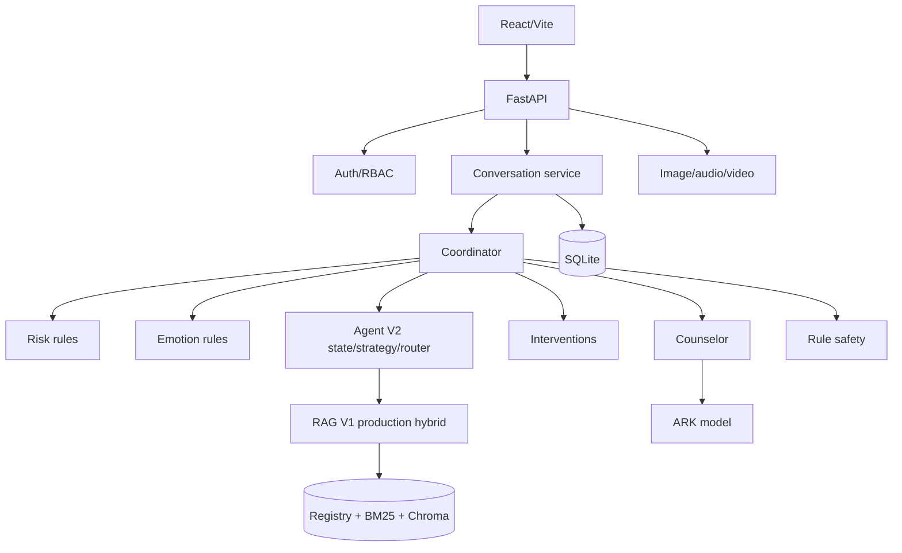

# CARE-Psy Current System Audit

Audit date: 2026-09-07  
Project: `psych-ai-companion`  
Scope: strict current-state audit only. No production logic, user data, roles, KB review status, publication state, or model switch was changed.

## Executive Verdict

CARE-Psy is a real development-stage system, not an empty scaffold. The normal text path is wired end to end: frontend conversation API, ownership/RBAC checks, risk and emotion analysis, Agent V2 local state/strategy/RAG routing, production-approved RAG V1, ARK counseling, rule safety review, persistence, and response sanitization. High-risk messages take a deterministic crisis/referral branch before ordinary counseling.

The evidence does not support an unconditional production-readiness or clinical-effectiveness claim. Speech has a configured API key but no provider runtime verification in this audit, TTS and several companion surfaces are placeholders, async multimodal jobs have no discovered worker, the LLM safety-review flag is not wired, fine-tuned inference is not connected, official benchmark judging is incomplete, and production secret rotation/deployment hardening is unverified.

The strongest factual verification is local: frontend build passed and 109 backend tests passed against an isolated temporary SQLite database. No local HTTP server was running during the audit. The project root has no `.git` directory, so branch and commit provenance are unavailable.

## Architecture



Detailed flow: [end_to_end_message_flow.md](C:/Users/renshuomeng/Documents/Codex/2026-06-30/ban/psych-ai-companion/docs/system_audit/end_to_end_message_flow.md).

## Status Snapshot

| Capability | Status |
|---|---|
| Normal text chat | `IMPLEMENTED_AND_ACTIVE` |
| High-risk crisis referral | `IMPLEMENTED_AND_ACTIVE` |
| Agent V2 local orchestration | `IMPLEMENTED_AND_ACTIVE` |
| Counselor ARK generation | `IMPLEMENTED_AND_ACTIVE` |
| Rule risk quality | `PARTIALLY_IMPLEMENTED` |
| LLM safety review | `IMPLEMENTED_BUT_NOT_WIRED` |
| Session memory | `IMPLEMENTED_AND_ACTIVE` |
| Global memory | `IMPLEMENTED_BUT_DISABLED` |
| Image analysis | `IMPLEMENTED_AND_ACTIVE` |
| Audio ASR in current environment | `IMPLEMENTED_BUT_DISABLED` |
| Video analysis | `PARTIALLY_IMPLEMENTED` |
| Async multimodal jobs | `IMPLEMENTED_BUT_NOT_WIRED` |
| STT endpoint | `MOCK_OR_PLACEHOLDER` |
| TTS | `NOT_IMPLEMENTED` |
| Production RAG V1 | `IMPLEMENTED_AND_ACTIVE` |
| Fine-tuned runtime model | `NOT_IMPLEMENTED` |
| Local evaluation | `IMPLEMENTED_AND_ACTIVE` |
| Official benchmark integration | `PARTIALLY_IMPLEMENTED` |
| LLM judge | `NOT_IMPLEMENTED` |
| RBAC | `IMPLEMENTED_AND_ACTIVE` |
| Production secrets | `PARTIALLY_IMPLEMENTED` |
| Cost accounting | `NOT_IMPLEMENTED` |

Full matrix: [feature_status_matrix.md](C:/Users/renshuomeng/Documents/Codex/2026-06-30/ban/psych-ai-companion/docs/system_audit/feature_status_matrix.md).

## What Was Verified

- FastAPI imports and registers 95 routes, including health, auth, chat, conversations, files, multimodal, knowledge, evaluation, debug, admin, and SPA fallback routes.
- `npm run build` passed: TypeScript and Vite production build completed, 66 modules transformed.
- Backend tests passed: `109 passed, 6 warnings` in 145.41 seconds using a temporary SQLite database.
- Agent V2 diagnostic passed: `local_rules_v1`, confidence `0.92`, `problem_solving`, and collections `interventions`, `professional_knowledge`, `campus_support`.
- Risk edge cases were exercised in code-level diagnostics: negation, past history, third-party report, quotation/reference, and joking language.
- No server was listening on the checked local development ports during the audit.
- Git commands failed because the project root is not a Git repository.

Verification details: [runtime_verification.md](C:/Users/renshuomeng/Documents/Codex/2026-06-30/ban/psych-ai-companion/docs/system_audit/runtime_verification.md).

## Current Configuration Risks

The observed runtime has `APP_ENV=development`, public access disabled, development mock disabled, ARK configured, speech API key configured but unverified, RAG V1 production enabled, and fallback disabled. JWT/session/admin bootstrap settings report configured; secret contents are excluded. Input/output cost rates are unset.

There is one active admin account in the current database. Credentials are intentionally excluded from this audit.

## RAG and Data Plane

The active retrieval path is production-approved hybrid RAG V1 using BM25 and Chroma with `BAAI/bge-m3`. The registry reports 67 enabled sources, 13,166 chunks, 6,631 approved chunks eligible for production, 1,648 pending, and 4,887 rejected. Production BM25 and dense indexes each report 6,631 eligible records.

The production dense index had zero observed vectors for `campus_support`, `evidence`, `governance`, and `safety`, while those collections exist in the registry or staging data. This is a coverage risk that should be explicitly verified before making domain-coverage claims. The legacy SQLite knowledge tables contain 20,093 chunks and 6 sources, which is a different data plane from the active registry/index files.

RAG details: [rag_audit.md](C:/Users/renshuomeng/Documents/Codex/2026-06-30/ban/psych-ai-companion/docs/system_audit/rag_audit.md).

## Safety and Multimodal Findings

The high-risk branch is active and deterministic. Risk detection is rule-based and conservative, but historical, quoted, third-party, and joking language still need labeled calibration. The active final safety step is rule-based; the configured-looking LLM review is not an active call and must not be represented as one.

Image analysis is active. Audio ASR is implemented but disabled by current configuration. Video processing is partial and depends on provider/keyframe/ffmpeg fallbacks. Async job APIs exist without a discovered worker and are not used by the primary multimodal page. The dedicated STT endpoint and video companion remain placeholder-level; TTS was not found.

## Evaluation and Model Findings

Local smoke/ablation evaluation, persistence, cached traces, dashboard actions, and Agent V2 integration cases exist. The metrics are local heuristics and dry-run adapters can use mock replies. Official external benchmark execution, an LLM judge, and fine-tuned runtime comparisons were not verified. SFT preparation exists and reports 2,000 selected records, but no fine-tuned model switch or runtime inference path is active.

Do not present local scores as official benchmark results.

## Highest-Priority Open Issues

1. Verify production secret injection, rotation, and restart persistence for auth/session settings.
2. Establish KB/index provenance and verify missing production dense collection coverage.
3. Build a privacy-safe labeled safety set and measure high-risk behavior, including edge contexts.
4. Choose authoritative prompt, model, and RAG data-plane sources; document or retire parallel legacy paths.
5. Add provider outage, retry, cost, and audit observability.
6. Decide whether async multimodal jobs are a supported product path; if yes, implement and operate a worker.
7. Add frontend route/method contract tests and improve the generic 405 diagnostic message.

Prioritized list: [open_issues_prioritized.md](C:/Users/renshuomeng/Documents/Codex/2026-06-30/ban/psych-ai-companion/docs/system_audit/open_issues_prioritized.md).

## What Was Not Done

No production feature was added. No current user data, admin role, KB review status, publication state, model switch, or real database row was changed. The only generated runtime artifacts were audit documents, the frontend build output, and isolated temporary test data.

## Machine-Readable State

[current_system_state.json](C:/Users/renshuomeng/Documents/Codex/2026-06-30/ban/psych-ai-companion/docs/system_audit/current_system_state.json)

The supporting reports in `docs/system_audit/` cover file inventory, architecture, message flow, high-risk behavior, multimodal processing, RAG, database, RBAC, evaluation, frontend, configuration, legacy paths, prompts/models, memory, Agent V2, verification, status matrix, priorities, roadmap, and prohibited next steps.

## Strict Follow-Up Pass

The original audit brief also requested separate wiring, environment, benchmark, inventory, route, and maturity artifacts. These are now present:

- [runtime_wiring_map.md](C:/Users/renshuomeng/Documents/Codex/2026-06-30/ban/psych-ai-companion/docs/system_audit/runtime_wiring_map.md) maps frontend page -> API -> router -> service/agent -> model/RAG -> storage.
- [environment_variables.md](C:/Users/renshuomeng/Documents/Codex/2026-06-30/ban/psych-ai-companion/docs/system_audit/environment_variables.md) records effective flags and configured/unconfigured status without secrets.
- [knowledge_inventory.md](C:/Users/renshuomeng/Documents/Codex/2026-06-30/ban/psych-ai-companion/docs/system_audit/knowledge_inventory.md) contains recomputed chunk/source-family counts.
- [retrieval_benchmark_audit.md](C:/Users/renshuomeng/Documents/Codex/2026-06-30/ban/psych-ai-companion/docs/system_audit/retrieval_benchmark_audit.md) separates the last actual staged run from planned targets.
- [legacy_and_duplicate_components.md](C:/Users/renshuomeng/Documents/Codex/2026-06-30/ban/psych-ai-companion/docs/system_audit/legacy_and_duplicate_components.md) records parallel runtime candidates.
- [frontend_route_matrix.md](C:/Users/renshuomeng/Documents/Codex/2026-06-30/ban/psych-ai-companion/docs/system_audit/frontend_route_matrix.md) records page guards and backend dependencies.
- [maturity_and_readiness.md](C:/Users/renshuomeng/Documents/Codex/2026-06-30/ban/psych-ai-companion/docs/system_audit/maturity_and_readiness.md) records engineering maturity scores, readiness estimates, and P0/P1/P2 IDs.

The strict end-to-end report now includes the requested 32-step message trace. The current effective runtime answer is: ordinary user chat uses production RAG V1 hybrid, not staging and not legacy fallback. The most recent RAG benchmark is a separate staged run with 162 queries.

## Current Terminal Summary

```text
========================================
CARE-Psy Current System Status
========================================
Demo Readiness: 82%
Competition Readiness: 65%
Production Readiness: 35%
Core Chat: IMPLEMENTED_AND_ACTIVE
Risk/Safety: PARTIALLY_IMPLEMENTED
Psychological State: IMPLEMENTED_AND_ACTIVE
Strategy: IMPLEMENTED_AND_ACTIVE
RAG: IMPLEMENTED_AND_ACTIVE (production RAG V1 hybrid)
Knowledge Base: PARTIALLY_IMPLEMENTED (review/index coverage split)
Evaluation: PARTIALLY_IMPLEMENTED
RBAC: IMPLEMENTED_AND_ACTIVE
Multimodal: PARTIALLY_IMPLEMENTED
Fine-tuned Model: NOT_IMPLEMENTED at runtime
Top 5 Blockers: risk calibration; production collection coverage; official judge; prompt-source split; deployment verification
Recommended Next Step: close the P0 audit findings before feature expansion
========================================
```
