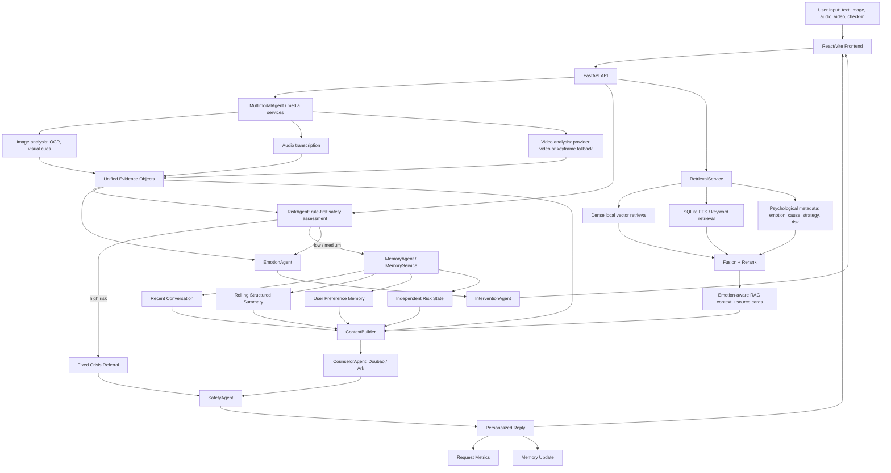

# CARE-Psy Current Architecture

Generated: 2026-08-10

## Notes

- Risk and safety remain ordered gates; they are not parallelized after generation.
- RAG, memory, and metrics can fail independently without disabling high-risk detection.
- Visual affect from images/videos is explicitly low-weight and cannot diagnose mental state or trigger high risk by itself.
- The current vector backend is SQLite with deterministic local embeddings; ChromaDB is not active because the package is not installed in the current Python environment.
