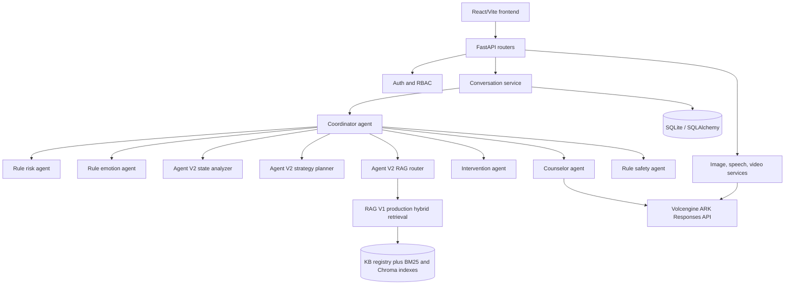

# Current Architecture

## Runtime Shape

## Active Primary Path

The current normal text path is:

`frontend conversation API -> conversation service -> coordinator -> risk -> emotion -> Agent V2 state/strategy/RAG route -> RAG V1 when requested -> interventions -> Counselor ARK -> Safety -> persistence and sanitized response`.

High-risk input branches before ordinary counseling and returns a fixed crisis-support/referral response. The current chat path is implemented and wired; it is not equivalent to a clinically validated service.

## Important Boundary

The runtime counselor uses an inline system prompt in `backend/agents/counselor_agent.py`. The separate `backend/prompts/counselor_prompt.txt` is not the runtime prompt source. The legacy `llm_service.py`, legacy retrieval path, and old database knowledge tables remain in the tree but are not the active primary route under current settings.

